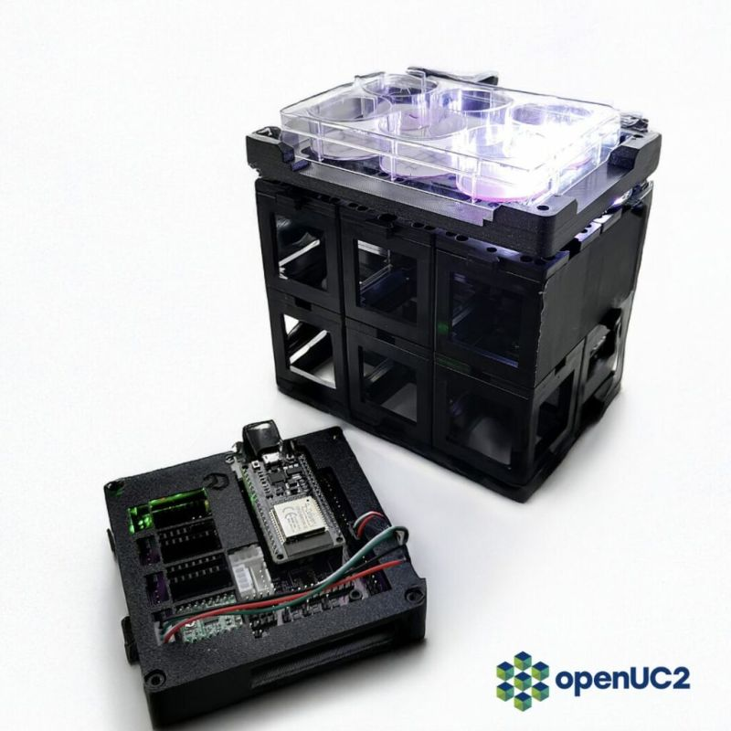

# Multi‑Camera Capture Demo

This repository shows a minimal **Python + OpenCV** example that grabs still frames from up to eight USB webcams on Linux.  Cameras are opened in pairs (to stay within the USB bus bandwidth limit), a frame is displayed in a 2 × 3 grid, and the handles are released before the next pair is opened.




## Requirements

| component  | tested version                       |
| ---------- | ------------------------------------ |
| Python     | ≥ 3.9                                |
| OpenCV     | 4.9+ (built with V4L2 support)       |
| NumPy      | ≥ 1.21                               |
| Matplotlib | ≥ 3.6                                |
| Linux      | kernel 5.\* / 6.\* with **uvcvideo** |

Install with `mamba env create -f environment.yml` or manually:

```bash
mamba create -n webcam python=3.11 opencv matplotlib numpy
mamba activate webcam
```

---

## Quick start

```bash
python getimage15_success.py        # grabs /dev/video1 … /dev/video8
```

All open‐error messages ("cam X: open failed", "read failed") are printed to STDOUT.

---

## Why **MJPEG**?

### The problem: *“No space left on device”*

When many USB‑2 webcams stream raw **YUYV 4:2:2** frames, the kernel driver must allocate a large number of in‑flight buffers.  Each 640 × 480 frame is 614 kB; at 30 fps even two cameras can exceed the default **usbfs\_memory\_mb** limit (16 MB).  The V4L2 subsystem then returns `-ENOSPC`, exposed by FFmpeg / OpenCV as:

```
[video4linux2,v4l2] ioctl(VIDIOC_STREAMON): No space left on device
```

### The solution: *compressed MJPEG*

Most UVC cameras can encode Motion‑JPEG in hardware.  The bulk data crossing the USB bus – and the temporary kernel buffers – shrink by a factor of 4‑10. For the same two 640 × 480 streams at 80 KiB each, you now need < 5 MB of kernel memory, well below the limit.

> “Force MJPEG and it works fine – RAW eats buffer space until `ENOSPC`.” — *⁠opencv/opencv #23787* citeturn0search0

### How to switch to MJPEG

1. **Programmatically** (preferred):

   ```python
   cap = cv2.VideoCapture('/dev/video3')
   cap.set(cv2.CAP_PROP_FOURCC, cv2.VideoWriter_fourcc(*'MJPG'))
   ```

2. **Persistently** with `v4l2-ctl`:

   ```bash
   sudo v4l2-ctl -d /dev/video3 \
        --set-fmt-video=width=640,height=480,pixelformat=MJPG
   ```

3. **Kernel quirk** (if the camera ignores MJPG requests):

   ```bash
   sudo modprobe -r uvcvideo
   sudo modprobe uvcvideo quirks=128   # FIX_BANDWIDTH_QUirk
   ```

---

## Script overview (`getimage15_success.py`)

* `cam_ids = (2,4,6,8,10,12)` – list of device numbers (**IMPORTANT** This may be different on your system - here it was multiple of two for some reason, 0 was inbuilt webcam)
* Loop in steps of 2: open two cameras → grab one frame each → display in grid → release both.
* GUI built with **Matplotlib** (`plt.subplots(2, 3)`).
* Uses **np.zeros** placeholders for empty slots if you have < 6 cameras.
* Press **Esc** to exit.

---

## Troubleshooting

| symptom                     | cause                         | fix                                            |
| --------------------------- | ----------------------------- | ---------------------------------------------- |
| `open failed`               | device busy (another process) | `fuser -v /dev/video*` then kill               |
| `read failed` after a while | cable power loss              | use powered hub / USB‑3 port                   |
| green/pink tint             | camera still in YUYV          | force MJPG as above                            |
| high CPU usage              | Matplotlib rendering          | call `plt.pause(0.001)` instead of tight sleep |

---

## License

MIT

---

## Acknowledgements

* OpenCV team and contributors.
* Original discussion: [https://github.com/opencv/opencv/issues/23787](https://github.com/opencv/opencv/issues/23787) (thanks to @tph-thuering for the MJPEG hint).

